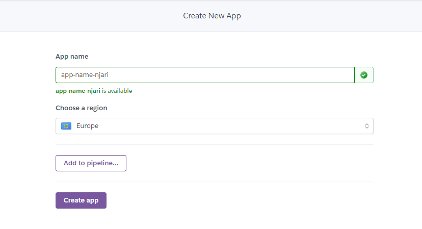

Heroku provides a fully managed Postgres Database service as a service. The database scales on demand and provides security in line with industry standards (Heroku Shield Service
provides PCI and HIPPA compliance for data in regulated industries like healthcare).
Heroku provides different plans for it's services one of which is it's Hobby tier which is free. This enables small hobby apps by e.g. students to be hosted for free.
In this tier, the postgres provides 1 Gb of storage and 20 connections. More info about it can be found [here](https://www.heroku.com/postgres).

You want to connect a spring boot application to such a database?

# Getting started with Heroku
To get  started, create a heroku account if you don't have one. [Heroku sign-up](https://signup.heroku.com/login).
After signing up, login and create a new app from the button near the top-right corner. An app has to be created since a database in heroku is a
resource for an app. Give the app a name and choose a region - skip the addition to a pipeline.



You have now created a heroku app successfully.

# Setting up Postgres
Select 'Resources' on the app ribbon and search for 'postgres' at the 'Add-ons' search field. Select 'Heroku Postgres' and
submit the order (on Hobby-Dev plan in our case). After creation, click on the
link to the created database and on the opened page, click on 'Settings' and then the 'Credentials' button.

The credentials include the;
- Host name,
- Database name,
- Username,
- Port,
- Password,
- Direct URI containing all the above details , and
- A heroku CLI access command.

# Connecting to a Spring Boot Application
In your `application.properties` file, replace the following fields with your heroku credentials (changed for security purposes):

```properties
spring.datasource.url=jdbc:postgresql://ec2-54-2-98-1.compute-1.amazonaws.com:5432/d13n7krvji
spring.datasource.username=kewiyuhjfdffbymlzf
spring.datasource.password=25b316638e063d5b03aaifld855j64a1a3e68abb71e71f64f56999ba13680d
```

# Acessing the Database from Local Machine
To access the database from another machine, you have to have Heroku CLI installed locally.

Download and install heroku CLI from https://devcenter.heroku.com/articles/heroku-cli
Make sure to check 'Add to path` box during installation.

Once installed, on a new shell, check installation success using `heroku --version`

Run `heroku login`. You'll be prompted to login on a browser, login with email address and
password used for heroku sign in.

Back on CLI, run the Heroku CLI access command in the credentials page in step two. e.g. `heroku pg:psql postgresql-aerodynamic-90339 --app ultra-techy-appone`

You can now run SQL commands;
```sql
SELECT * FROM tablename;
```

